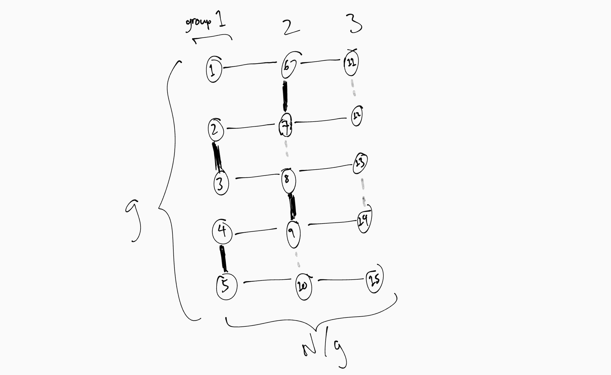

# ARC 152

## D. Halftree
Immediately it can be noted that there is no solution when $N$ is even.

When $N$ is odd, it's clear that when $K$ is coprime to $N$, then the period of $xK\mod{N}$ is $N$. Thus, simply adding $(K,2K\mod{N}),(3K\mod{N},4K\mod{N}),\dots,((N-1)K\mod{N},NK\mod{N})$ is sufficient to create a tree that is a line.

So an idea is to set $g=\gcd(N,K)$ and divide into $N/g$ groups of $g$. Adding an edge in group $i$ will be mirrored in group $(i+K/g)\mod(N/g)$. Since $K/g$ and $N/g$ are coprime, then we can create $N/g$ line graphs, each connecting all nodes equivalent mod $g$.

It's problematic to connect all these line graphs together, due to the fact that $N/g$ is odd (because $N$ is odd and $g\cdot{N/g}=N$) but we only operate in pairs of groups.

Let's focus on the case $N/g=3$. The solution is very easy to construct by hand:

 - Thin lines: part of the line graphs from beforehand
 - Thick lines: new edges to add
 - Dotted lines: will be added as a result of the thick lines

And it's really easy to extend to $N/g>3$.

Time complexity: $O(N)$.