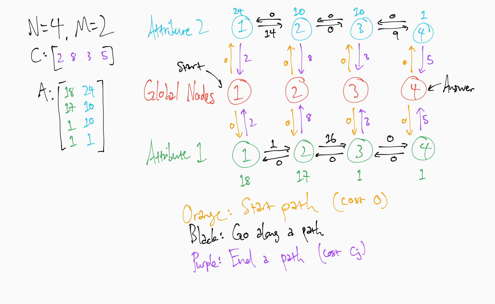

# Codeforces Round 930

## E. Pokémon Arena
Each pokemon is used at most once. Consider the chain of pokemon that you use; if a pokemon appears twice in the chain, then just delete all pokemon between those two instances and the chain is still valid. Clearly, the pokemon we switch in should always beat the existing pokemon; there's no point in wasting a turn.

For each attribute, draw a directed edge from $i$ to $j$ with the weight being the cost of switching from $i$ to $j$ for that attribute. Then run Dijkstra. There's no need to maintain the current stats of the current pokemon, as it's never optimal to fight with the same selected attribute twice in a row. Combine this with the observation that each pokemon is used at most once, so we modify at most one of its stats; selecting the same attribute twice is the equivalent to fighting with that modified stat again, so we really don't need to store it.

However, this runs in $O(N^2MlogN)$. We can do better by creating a set of <i>transition nodes</i>. Let's say that we're at node $i$ and want to transition to a node $j$ through attribute $k$. In this case, the cost is $\max(0,a_{j,k}-a_{i,k})$, plus $c_j$. The $c_j$ part is a fixed cost, so we can disregard it for now. But note that the cost of going from $i$ to $j$ through $k$ is just the difference between the two attributes.

So if we sort all the pokemon by a specific attribute, then the cost of going from a node $i$ to a node $j$ ($i>j)$ is equal to $(a_i-a_{i-1})+(a_{i-1}-a_{i-2})+\dots+(a_{j+1}-a_j)$, plus $c_j$. If $i<j$, then the cost if $0$. We can create a new set of $N$ nodes for this group, each corresponding to this attribute for a specific pokemon, and draw directed edges between for all $a_i\rightarrow a_{i-1}$ with cost $a_i-a_{i-1}$, and all edges $a_{i-1}\rightarrow{a_i}$ with cost $0$. Then the cost of any pokemon to any pokemon through this attribute is some path in this set of nodes. Effectively, we have reduced the number of edges to a factor of $NM$.

We have to add the cost of $c_j$ at the end. So create a global set of $N$ nodes. The cost of going from $i$ to $j$ through $k$ is the same thing as starting from global node $i$, transferring to the set of $N$ nodes corresponding to attribute $k$, following the path in that set to node $j$, then transferring back to the global node $j$. So the directed edge between the global node $i$ and all transition nodes $i$ is either $c_i$ or $0$ depending on the direction. The answer is the min dist to the global node $N$. Now, it runs in $O(NMlog(NM))$.

The set of global nodes is in the center, and the two paths corresponding to the attributes are on the ends. We can, for example, transition from pokemon $1$ to pokemon $2$ through attribute $1$, by taking the path to the set for attribute $1$, following the path to node $2$ in that set, then dropping back down the global node $2$. The total cost incurred is $0+14+8=22$.