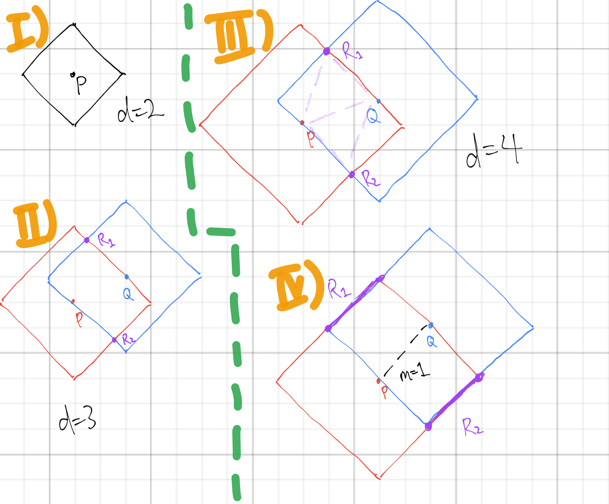

# Codeforces Round 951 (#1979)

## E. Manhattan Triangle
Draw the set of all points of a Manhattan distance $d$ away from some given $(x_1,y_1)$. The result is a square rotated $45°$.

1) Example of a square, showing all points of a Manhattan distance $2$ away from $P$.
2) We draw the square for $P$, and then place a point $Q$ on the square so it is $d$ away from $P$. Draw the corresponding square for $Q$. We see that the intersection of the two squares are possible locations for the third point $R$, which will complete the Manhattan triangle. However, when $d$ is odd, the third point is not at a lattice point, so it's impossible.
3) $d$ is even in this case. The two possible Manhattan triangles are also shown. (Another neat, but not exactly useful fact is that in these cases, the triangle is always isosceles!)
4) Another case. If the slope between the two initial points is $\pm{1}$, then the intersection are segments instead of points. Any lattice point $R$ on one of these segments will complete a valid Manhattan triangle $\triangle{PQR}$.

The third case is simply a subcase of the fourth, because no matter where $R$ is placed, the slope to $P$ or $Q$ will be $\pm{1}$. So taking the fourth case only, every Manhattan triangle has two points at slope $\pm{1}$.

We can solve for each case independently; I'll cover the case for $m=1$. Group together all points on the same diagonal line. Every point $(x,y)$ can pair up with either $(x+{d\over{2}},y+{d\over{2}})$ or $(x-{d\over{2}},y-{d\over{2}})$. 

Basically, within each diagonal line, sort all points by $x$ coordinate. For each point, look at the next point on its line and check if the above condition is satisfied. This gives us $N$ possible pairs to consider.

We then have to test if a valid third point exists. We have found $P$ and $Q$, and so looking at diagram 4, we can use some casework to calculate the positions of the two segments. They must be parallel to the line $PQ$ (both have slope $1$), so we can take the lines that they each lie on, and then use binary search to see if any points on that line fall in this segment. If a point exists, then we have found a triangle.

Repeat the above process for slopes $-1$. The time complexity is $O(NlogN)$.